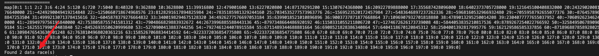
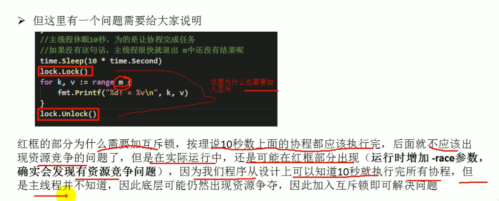

### 协程
协程是比线程还要轻量级的线程

### 通信
1. 添加全局变量
    ```go
   //锁
    lock sync.Mutex
    ```
2. 管道


### 注意点
1. 主线程执行完成之后，无论协程是否运行结束都会立刻停止运行
2. 查看是否有竞争
   ```bash
   go build -race 目标文件
   运行目标文件
   ```
   
3. 当协程执行之后，主线程不知道协程已经执行完成了，因此有可能默认还存在竞争,所以在输出的时候还需要加锁
   